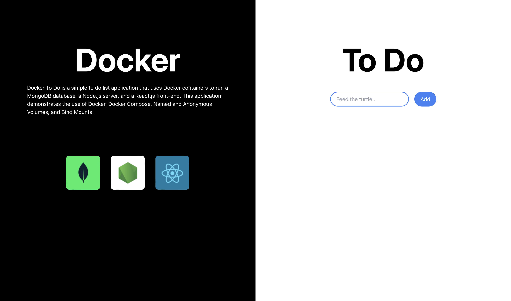

# Docker To Do

## Description
Docker To Do is a simple to do list application that uses Docker containers to run a MongoDB database, a Node.js server, and a React.js front-end. This application demonstrates the use of Docker, Docker Compose, Named and Anonymous Volumes, and Bind Mounts.

## Installation
### Docker Instructions
1. Pull the image from Docker Hub `docker pull oricodeio/docker-to-do`
2. Run `docker-compose up` in the root directory
3. Navigate to `localhost:3000` in your browser

### GitHub Instructions
1. Clone the repository
2. Run `docker-compose up` in the root directory
3. Navigate to `localhost:3000` in your browser

## Usage
- Create a new to do item by entering a title and description and clicking the `Add` button
- Mark a to do item as complete by clicking the `Complete` button

## Screenshots

